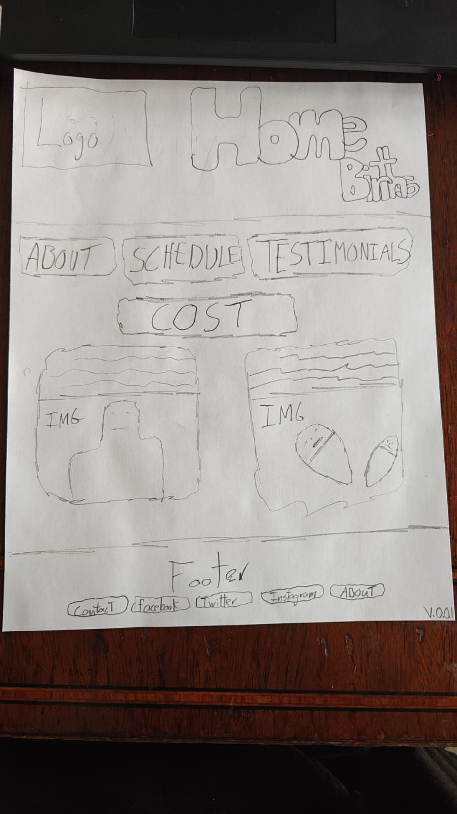

# Sunday Life Services site V1

## Frontend
The frontend will consist of `HTML`, `HTMX`, and `SCSS`.  `Javascript` will be used as a last resort and if needed,  it will be `Typescript`.  The development platform will be `Firefox`, my IDE will be `emacs`, and the template engine will be a `Jinja2` clone called `Askama`.

## Backend
The backend will be written in `Rust`.  The `Actix-web` is the web server.  This is the first web application I will be making from a repostitory template.  The template gives options to use any of four database singularly or in tandem. The databases are `Redis`, `Sqlite`, `Mongodb`, and `Postgresq1el`.

## Business Logic

The design and business logic of the site are to be provided by the proprietor of the site.

## TODO
- [ ] Design the four other html pages
- [ ] implement the four other html pages
- [ ] insert a user login (will be required for online payment later)
- [ ] implement user authorization 
- [X] implement user athentication
- [ ] Mongodb to save user information
- [X] Hash and salt user passwords
- [ ] Write tests to ensure functionality of payments
- [ ] Setup Github Actions to function on push
- [ ] Write tests to ensure functionality of user auth
- [X] Implement the mobile view of the web application
- [X] Setup Redis as a middle layer for near realtime retrieval
- [ ] Launch the site to Fly.io on the free layer
